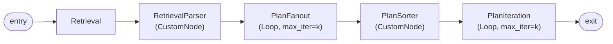
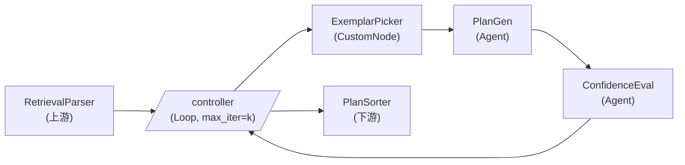
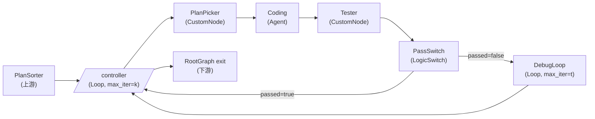
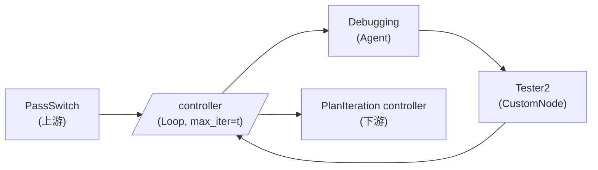

# MapCoder × MASFactory 复现：Graph 工作流设计

> 论文：[MapCoder: Multi-Agent Code Generation for Competitive Problem Solving](http://arxiv.org/abs/2405.11403)（ACL 2024）
>
> 复现目标：在 MASFactory 框架下，1:1 还原论文 Algorithm 1 的四智能体协同流水线（Retrieval → Planning(×k) → Coding → Debugging(×t)）与动态遍历控制流，并在 HumanEval 上跑出 Pass@1 冒烟数据。

## 1. 论文 / 原作代码 ↔ MASFactory 映射

| MapCoder 概念（论文 §3 / Alg.1 / Fig.8–10） | 行为 | MASFactory 映射 |
| --- | --- | --- |
| Retrieval Agent | 自检索 k 个相似题（含 description / code / plan）+ algorithm tutorial（Fig.8 XML 提示词） | 1× `Agent` + 1× `CustomNode`（XML 解析） |
| Planning Agent — Plan Generation（Fig.9 上） | 对单个 exemplar 生成 1 条针对原题的 plan | `Agent` |
| Planning Agent — Confidence Generation（Fig.9 下） | 同一 plan 的可信度评分 0–100 | `Agent`（独立的二次 LLM 调用，论文是两次 prompt） |
| Coding Agent（Fig.10 上） | 接受 plan + algorithm + 原题 → 生成代码 | `Agent` |
| Debugging Agent（Fig.10 下） | 用 sample I/O 反馈修复代码，最多 t 次 | `Agent` |
| Sample I/O Tester（Alg.1 第 15、21 行 `test(code, sample_io)`） | 跑样例测试，返回 passed / log；论文不生成额外测试 | `CustomNode`（自研：代码块抽取 + `subprocess` 沙箱 + 样例 assert 比对，详见 §5.1） |
| 计划排序（Alg.1 第 11 行 `SortByConfidence`） | 按 confidence 降序 | `CustomNode` |
| Outer Loop（Alg.1 第 13–27 行，遍历 k 个 plan，passed 即返回） | 动态遍历最多 k 轮 | `Loop`（`max_iterations=k`，`terminate_condition_function` 检查 `final_passed`） |
| Inner Loop（Alg.1 第 19–25 行，最多 t 次 debug） | 单 plan 内的 debug 重试 | 嵌套 `Loop`（`max_iterations=t`，passed 即终止） |
| Coding 后的"通过则返回 / 失败则进 debug"分支（Fig.1 dashed） | 二选一路由 | `LogicSwitch`（按 `full_passed` 二值路由） |
| 顶层流水线（Retrieval → Planning fanout → Sort → Outer Loop） | 串行编排 | `RootGraph` |

## 2. 顶层 Graph（RootGraph: `MapCoder`）



- 入口 attributes：`{problem, sample_io, language, k, t}`
- 出口字段：`{final_code, final_passed}`
- 装配方式：`RootGraph(name, nodes=[("name", template), ...], edges=[("src", "dst", {keys}), ...])`（参见 `masfactory/components/graphs/graph.py`）。

### 2.1 边上的字段契约

- `entry → Retrieval`：`{problem, language}`
- `Retrieval → RetrievalParser`：`{content}`（Agent 的原始 XML 文本输出）
- `RetrievalParser → PlanFanout`：`{exemplars: list[{description, code, plan}], algorithm: str, problem, sample_io, language}`
- `PlanFanout → PlanSorter`：`{plan_buffer: list[{plan, confidence, exemplar_idx}], problem, algorithm, sample_io, language}`
- `PlanSorter → PlanIteration`：`{sorted_plans, problem, algorithm, sample_io, language}`
- `PlanIteration → exit`：`{final_code, final_passed}`

## 3. PlanFanout 子图（k 路 plan 串行展开）

使用 `Loop` 串行展开（k 在运行时由入口 attribute 注入），是 MASFactory 中"对一组数据做相同处理 + 控制器累积结果"的惯用范式。



- **入边** `RetrievalParser → controller`：携带 `{exemplars, algorithm, problem, sample_io, language}`，落到 `controller.outsource_input`，第一轮注入 `_message_cache`，整个 fanout 期间复用。
- **出边** `controller → PlanSorter`：仅在 `terminate_condition_function` 返回 `True` 时打开；controller 把 `attrs["plan_buffer"]` 写进当轮 message 作为 output 返回，下游接 `{plan_buffer}`。
- **内部环路**：每轮 `controller → ExemplarPicker → PlanGen → ConfidenceEval → controller` 闭合一次。
- `terminate_condition_function`：每轮把 `{plan, confidence, exemplar_idx}` 追加到 `attributes["plan_buffer"]`；当 `current_iteration > len(exemplars)` 时返回 `True`。
- `ExemplarPicker.forward(input, attrs)`：根据 `attrs["current_iteration"]` 从 `exemplars` 列表中按下标取出对应项（不做排序），输出 `{exemplar_problem, exemplar_plan, algorithm, problem, sample_io, language}`。
- `PlanGen` Agent 的 prompt 即 Fig.9 上半 "Planning Generation Prompt"。
- `ConfidenceEval` Agent 的 prompt 即 Fig.9 下半 "Confidence Generation Prompt"，输出 XML，由轻量 regex 解析得到整数 `confidence`（解析失败兜底为 0）。

## 4. PlanIteration 子图（外层动态遍历，含内层 Debug Loop）



- **入边** `PlanSorter → controller`：携带 `{sorted_plans, problem, algorithm, sample_io, language}`，落入 `outsource_input` 并注入 `_message_cache`，整个外层循环期间复用。
- **出边** `controller → exit`：终止时 controller 把 `{final_code, final_passed}` 作为 output 返回，父图边 `("PlanIteration", "exit", {...})` 接到 RootGraph 出口。
- 外层 `terminate_condition_function`：`final_passed=True` 即终止；`current_iteration > k` 由框架兜底。
- `PlanPicker.forward(input, attrs)`：按 `attrs["current_iteration"] - 1` 索引 `sorted_plans`，输出 `{current_plan, problem, algorithm, sample_io, language}`。
- `PassSwitch`（`LogicSwitch`）双路由：
  - `passed`: `lambda msg, attrs: bool(msg.get("full_passed"))` → 直接回 controller，携带 `{final_code: code, final_passed: True}`，触发外层终止。
  - `failed`: `lambda msg, attrs: not bool(msg.get("full_passed"))` → 进入 `DebugLoop`。
- LogicSwitch 关闭未选中边的语义见 `masfactory/components/controls/base_switch.py`。

### 4.1 DebugLoop 嵌套循环（每个 plan 最多 t 次修复）



- **入边** `PassSwitch → controller`：携带 `{code, observation, current_plan, algorithm, sample_io, language}`，仅在 `PassSwitch` 路由到 failed 分支时打开。
- **出边** `controller → PlanIteration controller`：DebugLoop 终止时输出 `{final_code, final_passed}`。
- `terminate_condition_function`：每轮在 message 上写 `final_code = code`、`final_passed = full_passed`；`full_passed=True` 时返回 True；`current_iteration > t` 由框架兜底（这种情况 message 里的 final_code 是最后一次失败的代码，final_passed=False）。
- `Debugging` Agent 的 prompt 即 Fig.10 下半 "Debugging Agent" 模板。
- `Tester2` 与外层 `Tester` 共享同一份 CustomNode forward 实现。

## 5. 工程落地结构

完全自包含、不依赖任何已有 application 的代码：

```text
applications/mapcoder/
├── README.md
├── main.py                         # CLI: 加载 HumanEval + g.invoke(...) + 打印 Pass@1
├── docs/
│   └── workflow_design.md          # 本设计文档
├── workflows/
│   ├── __init__.py
│   ├── graph.py                    # 顶层 RootGraph + 子 Loop 装配
│   └── controllers.py              # PlanFanout / PlanIteration / DebugLoop 的 terminate_condition_function
├── components/
│   ├── __init__.py
│   ├── retrieval.py                # Retrieval Agent NodeTemplate + RetrievalParser CustomNode
│   ├── planning.py                 # PlanGen / ConfidenceEval Agent NodeTemplate + ExemplarPicker / PlanSorter / PlanPicker
│   ├── coding.py                   # Coding Agent NodeTemplate
│   ├── debugging.py                # Debugging Agent NodeTemplate
│   └── tester.py                   # Tester CustomNode：代码块抽取 + sandbox 执行 + sample I/O 校验
├── prompts/
│   ├── __init__.py
│   └── mapcoder_prompts.py         # 论文 Appendix B 全量 prompt 字符串
├── humaneval/
│   ├── __init__.py
│   ├── dataset.py                  # 加载 HumanEval JSONL + 解析 docstring 中的 sample I/O
│   └── runner.py                   # 子集驱动 + Pass@1 聚合
└── tests/
    └── test_tester_node.py         # Tester 节点的本地单测（不需要 API key）
```

### 5.1 Tester CustomNode 自研要点

- **代码抽取**：用正则 `r"```(?:python)?\s*(.*?)```"`（`re.DOTALL`）从 Coding/Debugging Agent 的输出中取出第一段代码；若不存在围栏，则把整段 `content` 视作代码（容错）。
- **样例 I/O 来源**：`humaneval/dataset.py` 解析 HumanEval `prompt` 字段里 `>>>` 或 `Examples:` 段落，得到 `list[(call_expr, expected_repr)]`；找不到时退化为题目 `test` 函数中的若干 assert 抽样作为 sample。
- **执行沙箱**：`subprocess.run([sys.executable, "-c", driver], timeout=10, capture_output=True)`；driver 文本拼接 `<candidate_code>\n<assert_block>`，每条 sample 一个 `assert <call> == <expected>`，捕获 `stdout/stderr` 与退出码。
- **输出契约**：返回 `{code, observation, full_passed}`，其中 `full_passed: bool`，`observation` 为失败时的 traceback / 全部 assert 通过时的 "All sample tests passed."。

> 注：私有 hidden test（用于 Pass@1 评分）只在 `humaneval/runner.py` 中跑一次，**不参与图内部决策**——这与论文一致（debug 仅依据 sample I/O）。

## 6. 关键节点 build 期参数（NodeTemplate 摘要）

```python
RetrievalAgentTemplate = NodeTemplate(
    Agent, model=model,
    instructions=RETRIEVAL_SYSTEM,
    prompt_template=RETRIEVAL_USER_TEMPLATE,
    formatters=[ParagraphMessageFormatter(), TwinsFieldTextFormatter()],
)

PlanGenTemplate = NodeTemplate(
    Agent, model=model,
    instructions=PLAN_GEN_SYSTEM,
    prompt_template=PLAN_GEN_TEMPLATE,
    formatters=[ParagraphMessageFormatter(), TwinsFieldTextFormatter()],
)

ConfidenceEvalTemplate = NodeTemplate(
    Agent, model=model,
    instructions=CONFIDENCE_SYSTEM,
    prompt_template=CONFIDENCE_TEMPLATE,
    formatters=[ParagraphMessageFormatter(), TwinsFieldTextFormatter()],
)

CodingAgentTemplate = NodeTemplate(
    Agent, model=model,
    instructions=CODING_SYSTEM,
    prompt_template=CODING_TEMPLATE,
    formatters=[ParagraphMessageFormatter(), TwinsFieldTextFormatter()],
)

DebuggingAgentTemplate = NodeTemplate(
    Agent, model=model,
    instructions=DEBUG_SYSTEM,
    prompt_template=DEBUG_TEMPLATE,
    formatters=[ParagraphMessageFormatter(), TwinsFieldTextFormatter()],
)

TesterTemplate = NodeTemplate(
    CustomNode, forward=run_sample_io_tests,
    pull_keys={"sample_io": ""},
    push_keys={"code": "", "observation": "", "full_passed": ""},
)
```

`TwinsFieldTextFormatter` 的语义：将 LLM 原始输出整体复制到每个 output edge key 上，不做 JSON / Markdown 解析。后续由各 CustomNode（RetrievalParser、ConfidenceEval 解析、Tester 等）做轻量 regex 抽取，避免 prompt 偏离论文。

## 7. 风险与开放点

- Retrieval / Planning 输出的 XML 解析：选 **regex + 异常 fallback**，与论文 prompt 一致。
- Confidence 解析失败时的兜底：默认 `confidence=0`，让该 plan 排到末尾。
- DebugLoop 的 `Tester2` 与外层 `Tester`：通过 `Shared(TesterTemplate)` 复用同一份 forward 实现。
- HumanEval `sample_io` 来源：从 `prompt` 的 docstring 抽取 `>>>` / `Examples:` 段；按论文 §6.4 可选合并 HumanEval-ET 中额外 sample（默认关闭）。
- 沙箱安全：subprocess 已隔离子解释器；固定 `timeout=10s` 并捕获 stderr。生产环境建议进一步走 docker，但 HumanEval 冒烟用例 subprocess 已足够。
